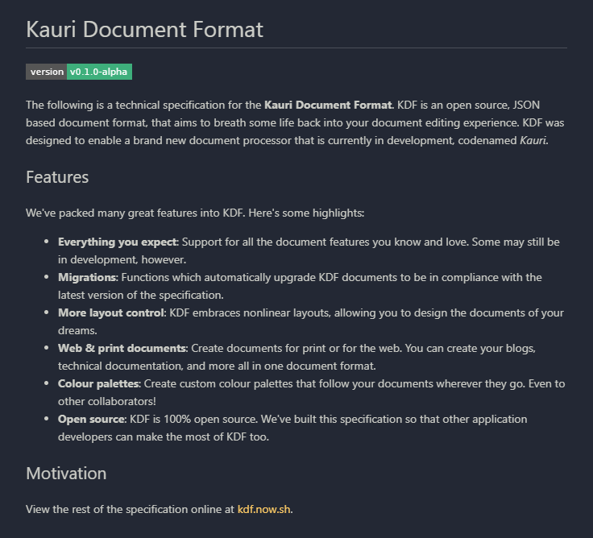

# Content

This page explores the differences between linear and nonlinear content, and the
consequences of separating the two forms. Note that all content can be found
within the `content.json` file.


## Linear Content

When you think of documents, it's likely that the first thing you think of is
*linear content*. With linear content, elements are defined and rendered in
order from the top of the document to the bottom. This is the most common way of
encoding document content, and most modern editors have been designed with only
this form in mind.

<figure>
  
  <figcaption>An example of linear content composed in a markdown editor.</figcaption>
</figure>

In KDF, linear content is represented as a [tree][1] of elements, as seen in the
example below. For further discussion about elements, and specifics on how to
use them, please see the [element reference][2].

```json
[
  {
    "type": "Heading",
    "level": 1,
    "children": [
      { "type": "Text", "content": "Australian Native Birds" }
    ]
  },
  {
    "type": "Paragraph",
    "children": [...]
  },
  {
    "type": "Figure",
    "children": [
      {
        "type": "Image",
        "source": "resource://images/KmyQd7tGtz.png"
      },
      {
        "type": "Caption",
        "children": [
          { "type": "Text", "content": "A Red-tailed Black Cockatoo" }
        ]
      }
    ]
  }
]
```

[1]: https://en.wikipedia.org/wiki/Tree_(data_structure)
[2]: /elements/


## Nonlinear Content

Unlike linear content, nonlinear content may be rendered anywhere in the
document, including on top of other content. Instead of being structure in a
tree, nonlinear content is organised into layers.