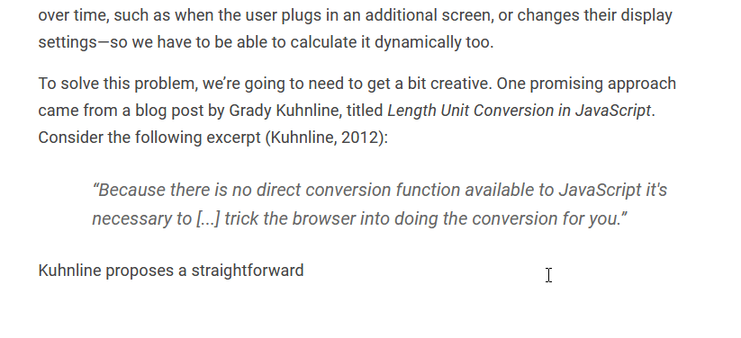

# Content

In KDF, documents are comprised of a series of elements arranged into a tree.


## Element Tree

TODO Explain the element tree.


```json
{
  "linear": [
    "heading",
    "paragraph",
    "image",
    "caption",
    "paragraph",
    "heading2",
    "paragraph",
  ],
  "nonlinear": [
    [
      "group",
      "textbox",
      "image",
    ]
  ]
}
```


## Headers & Footers

TODO


## Linear Content

When you think of documents, it's likely that the first thing you think of is
*linear content*. With linear content, elements are defined and rendered in
order from the top of the document to the bottom. This document is an example of
linear content, and so is the following image:



TODO above gif needs a lot more work

Traditional document processors primarily focus on this form of content, which\
is what causes layout issues whe mixing in nonlinear content.


## Nonlinear Content

TODO Explain nonlinear content with examples